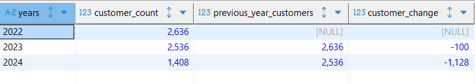

# Skincare Sales Data Exploratory Analysis (EDA)

---

## Project Overview

This project showcases an Exploratory Data Analysis (EDA) performed on a skincare sales dataset. The main goal was to uncover key insights into sales performance, profitability, customer behavior, and geographical market trends. By leveraging SQL queries, this analysis aims to identify strengths, weaknesses, and potential areas for strategic improvement within the business.

---

## Dataset Description

The dataset, named `Skin_Care Target.csv`, contains transactional sales data. Here are the key columns:

* **`order_id`**: Unique identifier for each transaction line item.
* **`product`**: Name of the product sold.
* **`category`**: Product category (e.g., 'Body care', 'Make up').
* **`subcategory`**: More specific product grouping (e.g., 'fragrances', 'Nail care products').
* **`sales`**: Revenue generated from the transaction.
* **`profit`**: Profit generated from the transaction.
* **`quantity`**: Number of units sold.
* **`discount`**: Discount applied to the transaction line item (numeric, e.g., 0.10 for 10%).
* **`order_date`**: Date of the order.
* **`customer_id`**: Unique identifier for the customer.
* **`segment`**: Customer segment (e.g., 'Consumer', 'Corporate').
* **`city`, `state`, `country`, `market`**: Geographical information.

---

## Tools Used

* **Excel**: For standardizing the data and removing duplicates.
* **PostgreSQL**: Database system used for storing and querying the data.

---
### General Metrics
* Total Revenue (2022-2024): $1,770,778
* Total Profit (Gross): $318,675
* Total Net Profit After Discounts: $60,004
* Total Products Sold: 6,388
* Total Categories Analyzed: 5
* Total Subcategories Analyzed: 17
---

### Key Findings

- **Customer Drop**: The number of unique customers remained stable from 2022 to 2023 but dropped by over 44% in 2024 (from a yearly count). This indicates a significant issue with customer acquisition and retention.
``` SQL
-- Customers lost across the years
WITH yearly_customers AS (
    SELECT
        TO_CHAR(st.order_date, 'YYYY') AS years,
        COUNT(DISTINCT st.customer_id) AS customer_count
    FROM skincare_target AS st
    GROUP BY years
)
SELECT
    years, customer_count,
    LAG(customer_count, 1) OVER (ORDER BY years) AS previous_year_customers,
    customer_count - LAG(customer_count, 1) OVER (ORDER BY years) AS customer_change
FROM yearly_customers
ORDER BY years;
```


- **Profitability Crisis**: Even before the operational halt, the business was facing a severe profitability crisis.
1. The analysis showed a direct correlation between high discount rates and poor performance across the years.
``` SQL
-- YoY revenue, profit, number of products sold, avg_discount, and net profit afer discounts
SELECT 
	TO_CHAR(st.order_date, 'YYYY') AS years,
	SUM(st.sales) AS revenue,
	SUM(st.profit) AS profit,
	SUM(st.sales * st.discount_percent) / SUM(st.sales) * 100 AS avg_discount,
	SUM(st.profit) - SUM(st.sales * st.discount_percent) AS net_profit_after_discount
FROM skincare_target AS st
GROUP BY TO_CHAR(st.order_date, 'YYYY')
ORDER BY TO_CHAR(st.order_date, 'YYYY');
```


2. Subcategories in Home and Accessories and Hair care were consistently unprofitable.
``` SQL
-- Drilling through sub-categories in Home and accesories and hair care category department
SELECT
    st.subcategory,
    SUM(st.sales) AS revenue,
    SUM(st.profit) AS total_profit,
    SUM(st.qty) AS qty_sold,
    SUM(st.sales * st.discount_percent) AS total_discount_amount,
    SUM(st.profit) - SUM(st.sales * st.discount_percent) AS net_profit_after_discount
FROM skincare_target AS st
WHERE st.category = 'Home and Accessories' OR st.subcategory = 'Hair care'
GROUP BY st.subcategory
ORDER BY net_profit_after_discount;
```
  

3.  Key geographic markets like Turkey, Nigeria, and Indonesia were operating at a significant loss due to unsustainable discounting.
``` SQL
-- Least profitable countries
SELECT 
	st.country, 
	SUM(st.sales) AS revenue, 
	SUM(st.profit) AS profit,
	SUM(st.qty) AS qty_sold,
	AVG(st.discount_percent) * 100 AS avg_discount_rate_percent,
	SUM(st.profit) - SUM(st.sales * st.discount_percent) AS net_profit_after_discount
FROM skincare_target AS st
GROUP BY st.country
ORDER BY net_profit_after_discount
LIMIT 10;
```


- **Customer Behavior**: Top customers were frequently purchasing these heavily discounted, unprofitable products, meaning the business was losing money on its most valuable customer segment.
``` SQL
-- Which product category do the top customers buy the most?
SELECT st.customer_id, st.segment, st.category, SUM(st.qty) AS total_qty_bought
FROM skincare_target AS st
WHERE st.customer_id IN ('SP-20620102', 'KN-1645082', 'EH-1376527')
GROUP BY st.customer_id, st.segment, st.category
ORDER BY st.customer_id, total_qty_bought DESC;
```
***


### Conclusion

The business's failure was twofold: a sudden cessation of operations in the second half of 2024, preceded by a severe profitability crisis in the first half of the year. This crisis was driven by a collapsing customer base and a flawed, geographically inconsistent discounting strategy.

***

### Recommendations

1.  **Investigate the Operational Halt**: The primary recommendation is to determine the cause of the sudden stop in sales after July 2024.
2.  **Adjust Pricing Strategy**: If operations were to resume, a complete overhaul of the pricing and discounting strategy would be necessary. This includes eliminating aggressive discounts on unprofitable products, especially in high-loss markets like Turkey and Indonesia.
3.  **Rebuild Customer Base**: A new strategy would be needed to attract and retain customers, as the business was losing a significant portion of its customer base even before the operational halt.
    
### How to Replicate This Analysis

To run this analysis on your own:

1.  **PostgreSQL Database:** Ensure you have a PostgreSQL database set up.
2.  **Load Data:** Import your `Skin_Care Target.csv` dataset into a table named `skincare_target` in your PostgreSQL database.
3.  **Execute Queries:** Use a SQL client (like psql, DBeaver, PgAdmin, or VS Code with a PostgreSQL extension) to connect to your database. Then, execute the SQL queries provided in the [`Skincare_Sales_EDA.sql`](Skincare_Sales_EDA.sql) file.

---
